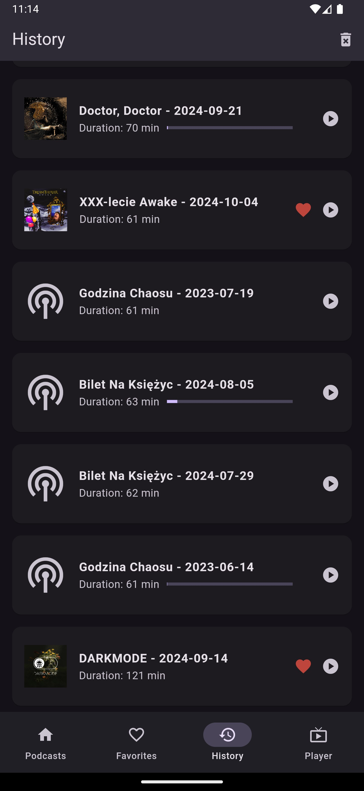

# Rockserwis Podcaster

Simple podcast player for rockserwis.fm internet radio.

## Features

- playing podcasts :)
- favorited podcasts
- favorited episodes
- dark/light theme
- history of listened episodes
- tracking the progress of the listened episode
- sorting episodes based on date field

## Screenshots

Podcasts list

  

Episodes list

  

Player

  

Favorited podcasts list

  

Favorited episodes list

  

History of listened episodes

  

## TODO

- filtering episodes by e.g.: last month, last year, custom range
- search (?)
- offline playback - downloading the episode locally before playing
